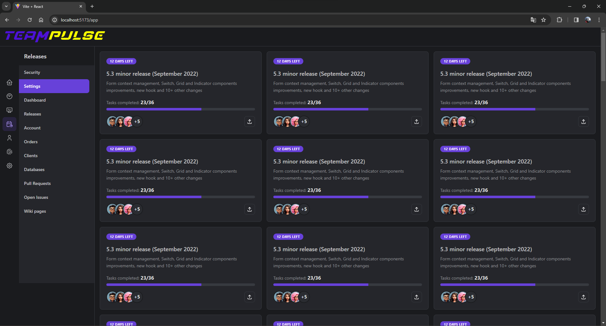

# TODO

V tom, co máte upravte následující:

- [ ] zabývat se pouze entitami workplace a task - upravit produkty v BM a datové úložiště v AM
  - [ ] **add**: Validace na BE a ABL (business logika)
  - [ ] **update**: Business Model Book
  - [ ] **update**: Application Model Book
- [ ] aktéři - zabývat se pouze Super User a Member
  - [ ] Zamerit se v knihach pouze na **App Owner** a **Member**
- [ ] pro workplace zpracovat CMDs create a get - implementace (upravit ABL a DAO) + dokumentace (BM a AM)
  - [ ] **fix code**: workspace-create (ABL/DAO)
  - [ ] **fix code**: workspace-get (ABL/DAO)
- [ ] pro task zpracovat CMDs create a list (upravit ABL a DAO) - implementace + dokumentace (BM a AM)
  - [x] **fix code**: task-create (ABL/DAO)
  - [x] **test**: task-create po změně ABL/DAO
  - [ ] **business logika**: task-create (kontrola session, ze ma spravnou roli (member a vyse) a ze je owner anebo member urciteho workspace ve kterem chce vytvorit task)
  - [ ] **fix code**: task-view (ABL/DAO)
  - [ ] **business logika**: task-create (kontrola session, ze ma spravnou roli (member a vyse) a ze je owner anebo member urciteho workspace ve kterem chce zobrazit tasky)
- [ ] FE - zpracovat routu workplace detail spolu se seznamem tasků - Admin uvidí tasky všech userů, user uvidí pouze svoje tasky - implementace + dokumentace (AM)

## Extra

- [ ] Session v headru misto body
- [ ] Nasazeni na cloud / server
- [ ] Prihlaseni 3. stranami (Google)

## Teampulse

## Important study / project links

- [Project assignment](https://uuapp.plus4u.net/uu-dockit-maing02/4e68298f1658473e9bf5692272883290/document?documentId=64ca0852a584300036f31e3e) contains all the requirements for the project.
- [Project portal](https://uuapp.plus4u.net/uu-dockit-maing02/4e68298f1658473e9bf5692272883290/document?documentId=6502e8b919026200367a8d60) workshop, evaluation, schedule and teams.
  - [Business Request](https://uuapp.plus4u.net/uu-bookkit-maing01/ce654e591da546fabe9f39e68670fb87/book) book (User Stories, Visions, etc.)
  - [Business Model](https://uuapp.plus4u.net/uu-bookkit-maing01/8c657f0dd6dd4278bfb6924afe55e049/book) book (Actors, Use Cases, etc.)
  - [Application Model](https://uuapp.plus4u.net/uu-bookkit-maing01/eeb83176237f4ec29040befc16fa05fa/book) book (Route, Schema, etc.)
- [uuSprintMan](https://uuapp.plus4u.net/uu-sprintman-maing01/1cc56c23ce5448c08d32ca7d490f26ab/sprint/current) project management (Backlog, Tasks, etc.)

- Case study **uuJokes**:
  - [uuJokes](https://uuapp.plus4u.net/uu-jokes-maing01/4ef6a7b01b5942ecbfb925b249af987f/jokes) - Link to the app
  - uuJokes - [Business Requests](https://uuapp.plus4u.net/uu-bookkit-maing01/a04c8463649b425fb8b46076c0c5e5d0/book/page?code=home)
  - uuJokes - [Business Model](https://uuapp.plus4u.net/uu-bookkit-maing01/a129e74e3bcc4fe4a4a95f5e4bb494ed/book/page?code=home)
  - uuJokes - [Application Model](https://uuapp.plus4u.net/uu-bookkit-maing01/71f8d7b5cfdc4336b0abfe47b3cb237b/book/page?code=home)

## Installation of the necessary software

- Visual Studio Code - <https://code.visualstudio.com/Download>
- Node.js - <https://nodejs.org/en/download>
- Git - <https://git-scm.com/downloads>
- API server tester (GET/POST):
  - Insomnia - <https://insomnia.rest/download>
  - Postman - <https://www.postman.com/downloads/>
  - Or use simple testing pages - <https://github.com/Neolker/TeamPulse/tree/main/backend/tests>

## Download and start the project

- Command `git clone https://github.com/Neolker/TeamPulse` or by using the GUI in VSCode
- Open two terminals, the first for **server**:
  - From the server folder `cd .\backend\`
  - Command `npm i` installs all necessary packages (Express.js etc.), just start once
  - **Server** then run the command `npm start`
  - Should it then **server** run on <http://localhost:8000>
  - To stop the **server** you can then use the keyboard shortcut `CTRL + C`, by type `Y` and confirmation `ENTER`
  - Rebooting with `npm start` - for example after a change in the server code (don't forget to save!) or you can use the `arrow up` in the terminal to scroll through commands from the history
- In the second terminal we run **client**:
  - Again, we move to the client folder  `cd .\frontend\`
  - Command `npm i` installs all necessary packages (React.js etc.)
  - **Client** then run the same `npm run dev` command
  - **Client** should start itself in the browser at: <http://localhost:5173/>
  - Exit **client** then use the same shortcut `CTRL + C`

## API Documentation

- **POST** requests pass parameters in JSON format in **Body**, mostly data from forms
- **GET** requests pass parameters that are part of the URL (route)

| URI                     | METHOD | INPUT                                                                                    | OUTPUT                                                                                |
| ----------------------- | ------ | ---------------------------------------------------------------------------------------- | ------------------------------------------------------------------------------------- |
| company/create          | POST   | `session`, `name`, `description`, `owner_id`                                             | `awid`, `name`, `description`, `owner_id`, `users[] {id, roles[]}`                    |
| company/get             | GET    | `session`, `awid`                                                                        | `awid`, `name`, `description`, `owner_id`, `users[] {id, roles[]}`                    |
| company/update          | POST   | `session`, `awid`, `name`, `description`, `owner_id`                                     | `awid`, `name`, `description`, `owner_id`, `users[] {id, roles[]}`                    |
| company/view            | GET    | `session`                                                                                | `companies[] {awid, name, description, owner_id, users[] {id, roles[]}}`              |
| company/add-user        | GET    | `session`, `awid`, `user_id`, `roles[]`                                                  | `awid`, `name`, `description`, `owner_id`, `users[] {id, roles[]}`                    |
| company/delete-user     | GET    | `session`, `awid`, `user_id`                                                             | `awid`, `name`, `description`, `owner_id`, `users[] {id, roles[]}`                    |
|                         |        |                                                                                          |                                                                                       |
| workspace/create        | POST   | `session`, `awid`, `name`, `description`, `owner_id`                                     | `id`, `awid`, `name`, `description`, `owner_id`, `members[] {id}`                     |
| workspace/get           | GET    | `session`, `id`                                                                          | `id`, `awid`, `name`, `description`, `owner_id`, `members[] {id}`                     |
| workspace/update        | POST   | `session`, `id`, `name`, `description`, `owner_id`                                       | `id`, `awid`, `name`, `description`, `owner_id`, `members[] {id}`                     |
| workspace/delete        | POST   | `session`, `id`                                                                          | `deleted`                                                                             |
| workspace/view          | GET    | `session`                                                                                | `workspaces[] {id, awid, name, description, owner_id, members[] {id}}`                |
| workspace/add-member    | GET    | `session`, `id`, `user_id`                                                               | `id`, `awid`, `name`, `description`, `owner_id`, `members[] {id}`                     |
| workspace/delete-member | GET    | `session`, `id`, `user_id`                                                               | `id`, `awid`, `name`, `description`, `owner_id`, `members[] {id}`                     |
|                         |        |                                                                                          |                                                                                       |
| task/create             | POST   | `session`, `worspace_id`, `name`, `description`, `solver_id`, `deadline`, `status`       | `worspace_id`, `id`, `name`, `description`, `solver_id`, `deadline`, `status`         |
| task/get                | GET    | `session`, `id`                                                                          | `worspace_id`, `id`, `name`, `description`, `solver_id`, `deadline`, `status`         |
| task/update             | POST   | `session`, `id`, `worspace_id`, `name`, `description`, `solver_id`, `deadline`, `status` | `worspace_id`, `id`, `name`, `description`, `solver_id`, `deadline`, `status`         |
| task/delete             | POST   | `session`, `id`                                                                          | `deleted`                                                                             |
| task/view               | GET    | `session`                                                                                | `tasks[] {worspace_id, id, name, description, solver_id, deadline, status}`           |
|                         |        |                                                                                          |                                                                                       |
| user/create             | POST   | `session`, `firstname`, `lastname`, `email`, `password`, `active`, `superadmin`          | `id`, `firstname`, `lastname`, `email`, `session`, `password`, `active`, `superadmin` |
| user/get                | GET    | `session`, `id`                                                                          | `id`, `firstname`, `lastname`, `email`, `session`, `password`, `active`, `superadmin` |
| user/update             | POST   | `session`, `id`, `firstname`, `lastname`, `email`, `active`, `superadmin`                | `id`, `firstname`, `lastname`, `email`, `session`, `password`, `active`, `superadmin` |
| user/passwd             | POST   | `session`, `id`, `password`                                                              | `id`, `firstname`, `lastname`, `email`, `session`, `password`, `active`, `superadmin` |
| user/view               | GET    | `session`                                                                                | `users[] {id, firstname, lastname, email, session, password, active, superadmin}`     |
| user/login              | POST   | `email`, `password`                                                                      | `id`, `firstname`, `lastname`, `email`, `session`, `password`, `active`, `superadmin` |
| user/logout             | POST   | `session`                                                                                | `logouted`                                                                            |
